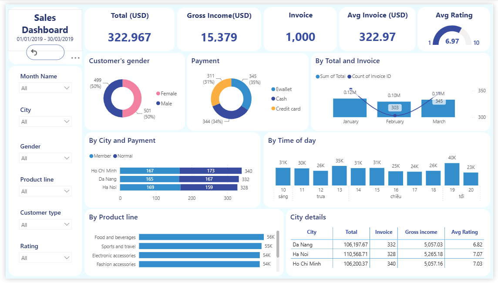

# Supermarket Sales Customer Analytics Dashboard

> **Dự án Data Analyst — Phân tích hiệu suất bán hàng bán lẻ bằng Power BI**

Dự án thực hiện phân tích dữ liệu bán hàng bán lẻ nhằm đánh giá **doanh thu, hiệu suất sản phẩm, hành vi khách hàng, thời điểm mua hàng và mức độ hài lòng của khách hàng**.

Thay vì chỉ tập trung vào việc xây dựng biểu đồ, dự án được thực hiện theo một quy trình phân tích hoàn chỉnh:

**EDA → ETL → Data Modeling → KPI → Business Questions → Visualization → Insight → Recommendation**

Mục tiêu là chuyển đổi dữ liệu giao dịch thô thành **thông tin có cấu trúc, insight có ý nghĩa và các đề xuất có thể hỗ trợ quyết định kinh doanh**.

---

## 📸 Dashboard Preview



> **Interactive dashboard:** `Retail Sales Performance Analysis.pbix`

Dashboard được xây dựng bằng Power BI, cho phép người dùng theo dõi tổng quan hiệu suất bán hàng và phân tích dữ liệu theo nhiều chiều như **thời gian, thành phố, nhóm sản phẩm, loại khách hàng, giới tính và rating**.

---

# 🎯 1. Tổng quan dự án

Dataset bao gồm **1.000 giao dịch bán hàng** tại **3 thành phố** trong **3 tháng đầu năm 2019**.

Dự án tập trung trả lời các câu hỏi kinh doanh như:

* Doanh thu thay đổi như thế nào theo từng tháng?
* Thành phố nào có số lượng giao dịch và doanh thu cao nhất?
* Khung giờ nào khách hàng mua hàng nhiều nhất?
* Nhóm sản phẩm nào đóng góp nhiều doanh thu nhất?
* Hành vi mua hàng có khác nhau giữa các thành phố và phân khúc khách hàng không?
* Rating thấp có tập trung ở một số nhóm sản phẩm hoặc khu vực nhất định không?
* Những phát hiện trên có thể dẫn đến hành động kinh doanh nào?

---

# 📌 2. Kết quả tổng quan

| Chỉ số                      |          Kết quả |
| --------------------------- | ---------------: |
| 💰 Tổng doanh thu           | **~322.967 USD** |
| 🧾 Số lượng giao dịch       |        **1.000** |
| 💵 Giá trị trung bình / đơn |  **~322,97 USD** |
| 📈 Gross Income             |  **~15.379 USD** |
| ⭐ Rating trung bình         |    **6,97 / 10** |
| 🏙️ Số thành phố            |            **3** |
| 🛍️ Số nhóm sản phẩm        |            **6** |
| 📅 Thời gian phân tích      |   **01–03/2019** |

---

# 🔎 3. Các insight chính

### 📅 Theo tháng

Tháng 1 ghi nhận doanh thu cao nhất, khoảng **116.291 USD**, trong khi tháng 2 giảm xuống khoảng **97.219 USD** trước khi phục hồi vào tháng 3.

Mức biến động giữa các tháng không quá lớn, do đó chưa cho thấy dấu hiệu bất thường rõ rệt trong dữ liệu.

> **Lưu ý:** Dataset chỉ bao gồm 3 tháng nên chưa đủ dữ liệu để khẳng định nguyên nhân của biến động theo mùa. Cần dữ liệu lịch sử dài hơn để kiểm chứng giả thuyết về seasonality.

---

### 🕐 Theo khung giờ

Doanh thu tập trung cao nhất vào khoảng **19:00 (~40.000 USD)**, tiếp theo là **13:00 (~35.000 USD)**.

Khoảng thời gian **13:00–15:00** cũng duy trì mức doanh thu tương đối cao và ổn định.

Điều này cho thấy đây có thể là những thời điểm quan trọng để doanh nghiệp theo dõi về:

* Lưu lượng giao dịch
* Nhân sự phục vụ
* Hoạt động marketing
* Chương trình khuyến mãi
* Khả năng đáp ứng vận hành

---

### 🛍️ Theo nhóm sản phẩm

**Food and Beverages** là nhóm có doanh thu cao nhất, khoảng **56.145 USD**, theo sau là **Sports and Travel** với khoảng **55.123 USD**.

Nhóm có doanh thu thấp nhất là **Health and Beauty**, khoảng **49.194 USD**.

Khoảng cách giữa nhóm cao nhất và thấp nhất chỉ khoảng **13%**, cho thấy doanh thu được phân bổ tương đối đồng đều giữa các nhóm sản phẩm thay vì phụ thuộc quá lớn vào một category duy nhất.

Ngoài ra, nhóm sản phẩm dẫn đầu có sự khác biệt giữa các thành phố:

* **TP. Hồ Chí Minh:** Home and Lifestyle
* **Đà Nẵng:** Sports and Travel

Điều này cho thấy nhu cầu sản phẩm có thể khác nhau theo từng khu vực và phân khúc khách hàng.

---

### ⭐ Theo rating

Rating trung bình toàn hệ thống đạt khoảng **6,97/10**.

**Đà Nẵng** có rating trung bình thấp nhất trong 3 thành phố, khoảng **6,82/10**.

Theo nhóm sản phẩm, **Home and Lifestyle** có tỷ trọng tương đối cao trong nhóm rating thấp.

Đây là những tín hiệu cần được tiếp tục kiểm tra thay vì kết luận trực tiếp về nguyên nhân, chẳng hạn thông qua:

* Feedback của khách hàng
* Product-level analysis
* Chất lượng sản phẩm
* Customer service
* Hiệu suất từng chi nhánh
* Dữ liệu vận hành

---

# 💡 4. Business Recommendations

Dựa trên các pattern quan sát được trong dữ liệu, dự án đưa ra ba hướng hành động chính:

### 1. Rà soát Home and Lifestyle

Kiểm tra sâu hơn các sản phẩm và giao dịch thuộc nhóm **Home and Lifestyle**, đặc biệt những transaction có rating thấp, để xác định liệu vấn đề đến từ sản phẩm, kỳ vọng khách hàng hay trải nghiệm dịch vụ.

### 2. Theo dõi hiệu suất tại Đà Nẵng

Đà Nẵng có rating trung bình thấp nhất, do đó nên được ưu tiên phân tích sâu hơn về:

* Customer feedback
* Product mix
* Sales performance
* Service quality
* Operational performance

### 3. Tối ưu nguồn lực trong giờ cao điểm

Doanh thu tập trung mạnh vào khoảng **13:00 và 19:00**, doanh nghiệp có thể xem xét bố trí nhân sự và năng lực vận hành phù hợp với các khung giờ này.

Đồng thời có thể đánh giá khả năng triển khai các chương trình marketing hoặc promotion vào thời điểm có lượng khách hàng cao.

> Các recommendation trên được xây dựng dựa trên các tín hiệu quan sát được từ dataset. Những giả thuyết về nguyên nhân cần được kiểm chứng bằng dữ liệu lịch sử, dữ liệu sản phẩm chi tiết hoặc dữ liệu vận hành bổ sung.

---

# 🧠 5. Analytical Approach

Dự án được thực hiện theo 5 giai đoạn chính.

## 5.1 Exploratory Data Analysis — EDA

Dữ liệu gốc được cung cấp dưới dạng CSV và được sao chép sang một file Excel riêng để phục vụ quá trình khám phá dữ liệu.

Trước khi phân tích, các trường dữ liệu được tìm hiểu dựa trên Dataset Description nhằm:

* Hiểu ý nghĩa của từng trường
* Xác định mối quan hệ giữa các trường dữ liệu
* Kiểm tra kiểu dữ liệu
* Phát hiện giá trị trống
* Kiểm tra định dạng dữ liệu
* Kiểm tra các bản ghi có khả năng trùng lặp
* Xác định grain của dữ liệu giao dịch

---

## 5.2 Data Transformation & ETL

**Power Query trong Power BI** được sử dụng để thực hiện quy trình ETL.

Từ bảng dữ liệu giao dịch chính, các bảng dimension được xây dựng để hỗ trợ quá trình phân tích:

* **Fact Sales**
* **Dim Date**
* **Dim Time**
* **Dim Rating**

Một số bước xử lý bao gồm:

* Chuẩn hóa kiểu dữ liệu
* Kiểm tra và xử lý duplicate
* Tạo các trường ngày và tháng
* Tạo các trường giờ và buổi trong ngày
* Phân nhóm rating
* Sắp xếp tháng theo đúng thứ tự thời gian
* Sắp xếp các khung giờ theo trình tự thực tế

---

# 🏗️ 5.3 Data Modeling

Mô hình dữ liệu được xây dựng theo **Star Schema**.

```text
                    ┌──────────────┐
                    │   Dim Date   │
                    └───────┬──────┘
                            │
                            │
┌──────────────┐     ┌─────▼──────┐     ┌──────────────┐
│   Dim Time   │────▶│ Fact Sales │◀────│  Dim Rating  │
└──────────────┘     └────────────┘     └──────────────┘
```

Trong đó:

### Fact Sales

Chứa dữ liệu giao dịch và các measure business như:

* Sales
* Quantity
* Tax
* Gross Income
* Rating

### Dim Date

Chứa các thuộc tính liên quan đến:

* Date
* Month
* Month Name

### Dim Time

Chứa:

* Hour
* Time of Day

### Dim Rating

Dùng để phân nhóm mức độ đánh giá của khách hàng.

Việc sử dụng Star Schema giúp mô hình dữ liệu dễ quản lý và thuận tiện cho việc phân tích theo nhiều dimension khác nhau.

---

# 📊 5.4 KPI & Business Questions

Các KPI chính được xác định trước khi xây dựng dashboard:

* **Total Sales**
* **Gross Income**
* **Invoice Count**
* **Average Invoice Value**
* **Average Rating**

Các KPI được kết hợp với những câu hỏi kinh doanh cụ thể.

Ví dụ:

> **Tháng nào có doanh thu cao nhất?**

→ Phân tích Sales theo Month.

> **Khung giờ nào có doanh thu cao nhất?**

→ Phân tích Sales theo Hour.

> **Nhóm sản phẩm nào đóng góp nhiều doanh thu nhất?**

→ Phân tích Sales theo Product Line.

> **Rating thấp có tập trung ở một số khu vực hoặc sản phẩm không?**

→ Phân tích Rating theo City và Product Line.

Cách tiếp cận này giúp đảm bảo mỗi visual được xây dựng để trả lời một câu hỏi phân tích cụ thể.

---

# 📈 5.5 Visualization & Insight

Dashboard được thiết kế để phân tích:

### Sales Performance

* Tổng doanh thu
* Gross Income
* Invoice Count
* Average Invoice
* Doanh thu theo tháng
* Doanh thu theo thành phố
* Doanh thu theo nhóm sản phẩm

### Customer Analysis

* Gender
* Customer Type
* Payment Method
* Customer Rating

### Time Analysis

* Sales theo giờ
* Sales theo buổi trong ngày
* Monthly performance

### Geographic Analysis

* City performance
* Invoice volume
* Gross Income
* Average Rating

Sau khi xây dựng visual, các pattern được kiểm tra và đối chiếu trước khi sử dụng làm insight hoặc recommendation.

---

# 📂 6. Repository Structure

```text
Retail-Sales-Performance-Analysis/
│
├── 📁 assets/
│   └── 🖼️ dashboard.png
│
├── 📄 Additional notes.docx
│
├── 📖 README.md
│
├── 📊 Retail Sales Performance Analysis.pbix
│
├── 📄 Summary document.docx
│
└── 📋 sale_data.csv
```

---

# 📚 7. Tài liệu chi tiết

README này cung cấp phần **tổng quan** về project.

Nếu muốn tìm hiểu sâu hơn về quá trình thực hiện, analytical reasoning, insight và recommendation, hãy đọc thêm hai tài liệu được đính kèm trong repository.

### 📄 Summary document.docx

Đây là tài liệu tổng hợp kết quả phân tích, bao gồm:

* Tổng quan business performance
* Phân tích theo tháng
* Phân tích theo khung giờ
* Phân tích product line
* Phân tích theo thành phố
* Phân tích rating
* Các insight chính
* Nhận xét
* Business recommendations

👉 **[Mở Summary document](./Summary%20document.docx)**

---

### 📝 Additional notes.docx

Tài liệu này chứa các **ghi chú bổ sung và thông tin chi tiết hơn về quá trình thực hiện project**, giúp người đọc hiểu rõ hơn về các quyết định trong quá trình xử lý và phân tích dữ liệu.

👉 **[Mở Additional notes](./Additional%20notes.docx)**

---

### 📊 Power BI Dashboard

File Power BI chứa:

* Data model
* Power Query transformations
* DAX calculations
* Interactive dashboard
* Filters / slicers
* Visualizations

👉 **[Mở Power BI file](./Retail%20Sales%20Performance%20Analysis.pbix)**

> Cần **Microsoft Power BI Desktop** để mở file `.pbix`.

---

### 📋 Source Dataset

Dataset giao dịch gốc được lưu trong file:

👉 **[sale_data.csv](./sale_data.csv)**

---

# 🛠️ 8. Tools & Technologies

| Công cụ         | Mục đích                             |
| --------------- | ------------------------------------ |
| **Excel**       | Khám phá và kiểm tra dữ liệu ban đầu |
| **Power Query** | ETL và Data Transformation           |
| **Power BI**    | Data Modeling, DAX và Visualization  |
| **CSV**         | Dữ liệu nguồn                        |
| **Star Schema** | Mô hình hóa dữ liệu phân tích        |

---

# 🎓 9. Skills Demonstrated

## Data Analysis

* Exploratory Data Analysis
* Data quality checking
* Business question formulation
* KPI definition
* Pattern identification
* Insight generation
* Business recommendation

## Data Preparation

* Data cleaning
* Data transformation
* Data type validation
* Duplicate checking
* ETL using Power Query

## Data Modeling

* Fact & Dimension tables
* Star Schema
* Table relationships
* Time dimension
* Analytical modeling

## Power BI

* Interactive dashboard
* DAX measures
* KPI cards
* Slicers
* Time-series analysis
* Comparative analysis
* Drill-down analysis
* Dynamic filtering

## Business Analysis

* Sales performance
* Product performance
* Customer behavior
* Geographic analysis
* Customer satisfaction
* Time-based sales analysis

---

# 🔄 10. End-to-End Workflow

Toàn bộ project có thể được tóm tắt như sau:

```text
                    RAW DATA
                       │
                       ▼
                      EDA
                       │
                       ▼
              DATA CLEANING
                       │
                       ▼
                POWER QUERY
                 ETL PROCESS
                       │
                       ▼
                STAR SCHEMA
                       │
                       ▼
               KPI DEFINITION
                       │
                       ▼
             BUSINESS QUESTIONS
                       │
                       ▼
               POWER BI VISUALS
                       │
                       ▼
                    INSIGHT
                       │
                       ▼
               RECOMMENDATION
```

---

# 🎯 11. Project Takeaway

Điểm trọng tâm của project không chỉ là xây dựng một dashboard đẹp.

Project hướng tới việc thể hiện một quy trình Data Analyst hoàn chỉnh:

> **Từ dữ liệu thô → hiểu dữ liệu → chuẩn hóa dữ liệu → xây dựng mô hình → đặt câu hỏi kinh doanh → phân tích → tìm insight → đưa ra recommendation.**

Qua project này, các kỹ năng được thể hiện không chỉ nằm ở **Power BI**, mà còn ở khả năng **tư duy phân tích, data modeling và chuyển đổi dữ liệu thành thông tin có giá trị cho business**.

---

## 👤 Project Information

**Project Type:** Data Analyst Portfolio Project
**Domain:** Retail / Sales / Business Performance
**Dataset:** Retail Transaction Data
**Analysis Period:** January – March 2019
**Primary Tool:** Microsoft Power BI

---

⭐ **Nếu bạn đang review project này, hãy xem `Retail Sales Performance Analysis.pbix` cùng với `Summary document.docx` để có cái nhìn đầy đủ về cả dashboard và quá trình phân tích phía sau.**
